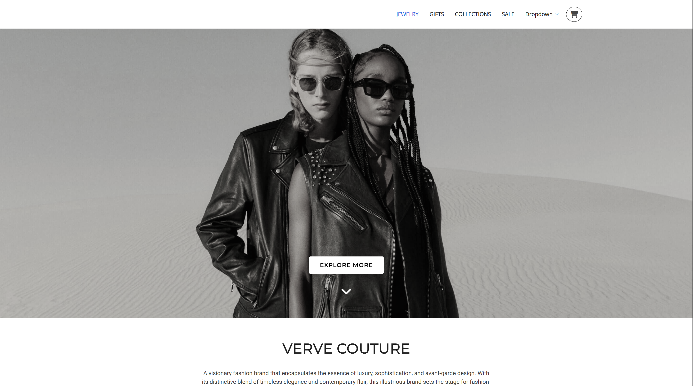

# Fashion Landing Page - VERVE COUTURE



## 📖 Giới thiệu

**VERVE COUTURE** là một trang web landing page hiện đại dành cho thương hiệu thời trang cao cấp. Website thể hiện tinh thần của thương hiệu - sự kết hợp hoàn hảo giữa sự sang trọng, tinh tế và thiết kế tiên phong.

> *"A visionary fashion brand that encapsulates the essence of luxury, sophistication, and avant-garde design. With its distinctive blend of timeless elegance and contemporary flair, this illustrious brand sets the stage for fashion-forward individuals seeking to make a bold statement."*

## ✨ Tính năng chính

- **Thiết kế responsive**: Tối ưu hiển thị trên mọi thiết bị
- **Hero Section**: Banner chính với call-to-action hấp dẫn  
- **Product Showcase**: Trưng bày các sản phẩm thời trang và trang sức
- **Navigation Menu**: Menu điều hướng với các mục: JEWELRY, GIFTS, COLLECTIONS, SALE
- **Shop Now Section**: Khu vực mua sắm với hình ảnh sản phẩm nổi bật
- **Social Media Integration**: Liên kết với các mạng xã hội

## 🛍️ Sản phẩm nổi bật

Website giới thiệu các danh mục sản phẩm chính:
- **Jewelry**: Trang sức cao cấp (Sparkling Earrings, Chain Earrings, Wallet Necklace)
- **Fashion**: Thời trang (Deep Black Sweater và nhiều items khác)
- **Gifts**: Quà tặng đặc biệt
- **Collections**: Bộ sưu tập thời trang
- **Sale**: Khu vực khuyến mãi

## 🔧 Công nghệ sử dụng

- **HTML5**: Cấu trúc trang web
- **CSS3**: Styling và responsive design
- **Bootstrap 5**: Framework CSS
- **JavaScript**: Tương tác và animation
- **AOS (Animate On Scroll)**: Hiệu ứng cuộn trang
- **GLightbox**: Lightbox cho hình ảnh
- **Swiper**: Slider/carousel
- **Font Awesome**: Icon fonts

## 📁 Cấu trúc thư mục

```
├── index.html              # Trang chủ chính
├── portfolio-details.html  # Trang chi tiết portfolio
├── service-details.html    # Trang chi tiết dịch vụ
├── starter-page.html      # Trang mẫu
├── assets/
│   ├── css/              # File CSS
│   ├── img/              # Hình ảnh
│   │   ├── FASHION/      # Hình ảnh thời trang
│   │   ├── portfolio/    # Hình ảnh portfolio
│   │   └── ...
│   ├── js/               # JavaScript files
│   └── vendor/           # Thư viện bên thứ 3
└── forms/                # Xử lý form
```

## 🚀 Hướng dẫn sử dụng

1. **Clone repository**:
   ```bash
   git clone [repository-url]
   ```

2. **Mở trang web**:
   - Mở file `index.html` bằng trình duyệt web
   - Hoặc sử dụng Live Server trong VS Code

3. **Tùy chỉnh**:
   - Chỉnh sửa nội dung trong `index.html`
   - Tùy chỉnh styles trong `assets/css/`
   - Thay đổi hình ảnh trong `assets/img/FASHION/`

## 🎨 Giao diện

- **Màu sắc**: Tông màu thanh lịch, sang trọng
- **Typography**: Font Roboto, Open Sans, Montserrat
- **Layout**: Grid layout responsive với Bootstrap
- **Animations**: Smooth scroll và fade-in effects

## 📱 Responsive Design

Website được thiết kế responsive, tối ưu cho:
- Desktop (1200px+)
- Tablet (768px - 1199px) 
- Mobile (< 768px)

## 🔗 Liên kết

- **Social Media**: Twitter, Facebook, Instagram, LinkedIn
- **Navigation**: Home, About us, Services, Terms of service

---

*Được phát triển cho thương hiệu thời trang VERVE COUTURE*